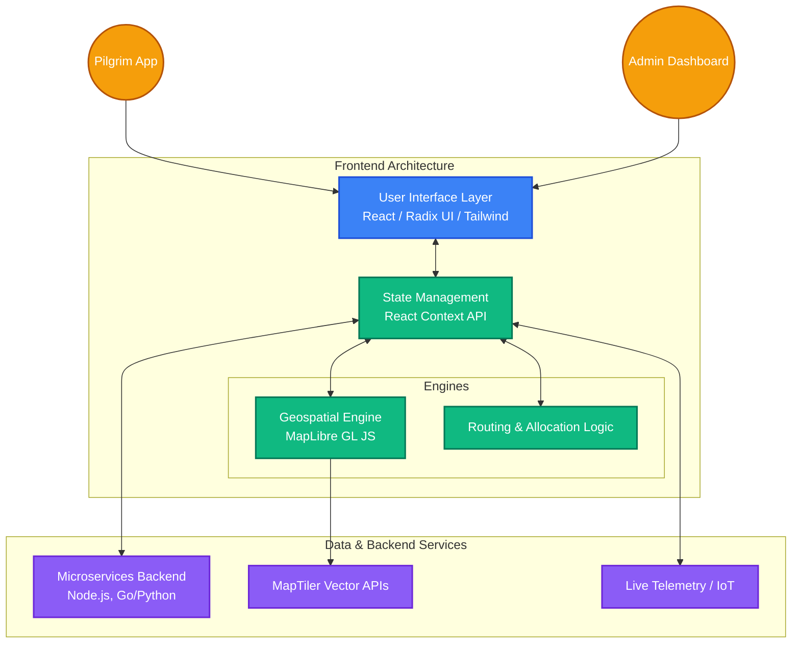

<div align="center">

# Kumbh Yatra - Digital Pilgrimage Management System

*A comprehensive digital pilgrimage management system for Mahakumbh Ujjain, featuring QR-based pass generation, crowd management, and real-time facility tracking.*

</div>

## 🚨 Problem

Managing massive crowds at the scale of Mahakumbh presents unprecedented challenges for administration and law enforcement. The lack of real-time insights into crowd density, localized bottlenecks, and facility utilization often leads to chaotic routing, safety hazards, and suboptimal resource allocation during peak pilgrimage periods.

## 💡 Solution

**Kumbh Yatra** provides a unified dynamic mobility management system designed specifically for large-scale events. By integrating QR-based pilgrim passes with heuristic gate assignments and real-time interactive mapping, the platform empowers administrators to intelligently distribute foot traffic, track resources, and maintain safe density levels across all sectors seamlessly.

## ✨ Features

- **QR Pass Generation**: Automated pass creation with multi-factor heuristic gate allocation.
- **Interactive Maps**: Real-time visualization of crowd density and facility tracking.
- **Admin Dashboard**: Comprehensive management tools for event oversight, drone fleet control, and real-time analytics.
- **Location Services**: GPS-based navigation and location tracking for pilgrims.
- **Crowd Management**: Dynamic load balancing, location-based optimization, and predictive capacity management.

## 🛠️ Tech Stack

- **Frontend**: React 18 with TypeScript
- **Styling**: Tailwind CSS with a customized theme setup
- **Maps**: MapLibre GL JS with MapTiler integration
- **UI Components**: Radix UI primitives for accessible design
- **State Management**: React Context API & Custom Hooks
- **Testing**: Vitest with React Testing Library
- **Build Tool**: Vite

## 🏗️ Architecture

The platform operates on a robust modular architecture powered by **React** and **TypeScript**, ensuring type safety, high performance, and long-term maintainability. 



Key architectural components include:
- **Geospatial Engine**: Integration of **MapLibre GL JS** with **MapTiler** vectors provides a high-fidelity, performant map foundation capable of rendering thousands of concurrent data points for crowd tracking.
- **State & Telemetry Service**: Application state is efficiently managed through a contextual hierarchy and custom React hooks. A service-oriented data layer is designed to ingest high-frequency telemetry data for rapid UI updates on the admin dashboard.
- **Routing & Allocation Logic**: A specialized heuristic engine evaluates multiple operational factors (gate capacities, path congestion, and facility load) to calculate optimal routing allocations dynamically.
- **Component-Driven UI**: Built with **Radix UI** primitives and **Tailwind CSS**, guaranteeing a highly accessible, responsive, and composable user interface across varying device constraints.

## 🚀 Setup / Installation

### Prerequisites

- Node.js (v18 or higher)
- npm or yarn

### Installation Steps

1. **Clone the repository:**
   ```bash
   git clone <repository-url>
   cd Kumbhh-Yatra-Mobility-management-system
   ```

2. **Install dependencies:**
   ```bash
   npm install
   ```

3. **Start the development server:**
   ```bash
   npm run dev
   ```

4. **Access the application:**
   Open your browser and navigate to `http://localhost:8080`.

## 🔮 Future Work

- **Microservices Backend Integration**: Implement a distributed, highly-scalable backend architecture (e.g., Node.js/Go with PostgreSQL/Redis) to handle peak concurrent user sessions seamlessly.
- **IoT & Sensor Data**: Integrate live IoT crowd monitoring sensors and BLE (Bluetooth Low Energy) beacons for highly accurate, real-time tracking.
- **AI/ML Forecasting**: Implement machine learning models to forecast high-density periods and preemptively alert administrators to potential bottlenecks.
- **Multi-lingual Support**: Add comprehensive regional language accessibility for diverse pilgrim demographics.
- **Mobile Application**: Roll out dedicated native Android and iOS applications for pilgrims and field workers.

## 📄 License

This project is licensed under the MIT License.
